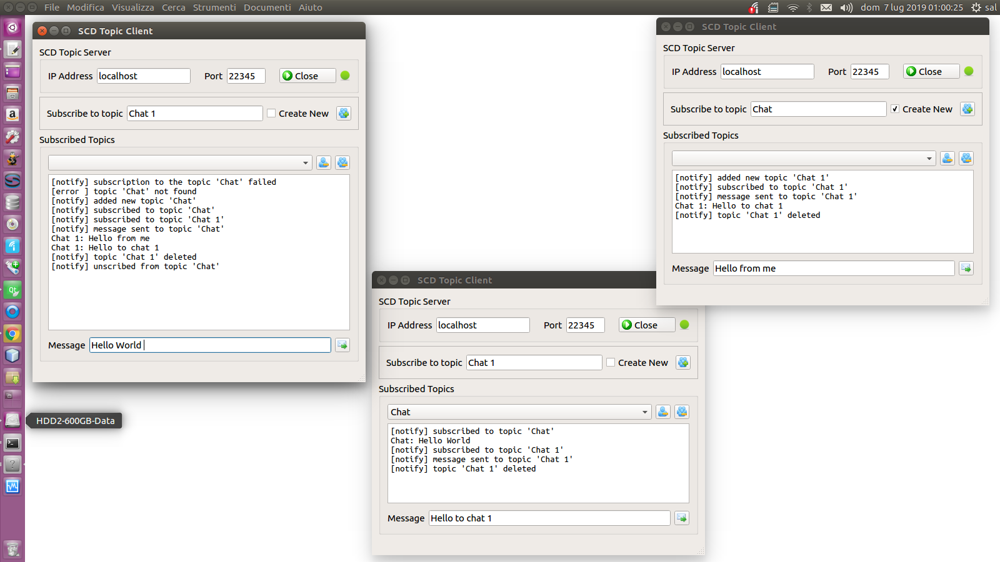

# SCD-TopicServer - Qt C++ Client/Server Class
Web Socket Topic Server: events notification to client processes subscribed to topic.

## Description

The topic server manage the exchange of message between processes subscribed to a topic. This is a form of interprocess communication. The communication type is one to many: the message sent to topic from one process is forwarded by server to all processes subscribed to topic.
This server is very simple. The server accept WEB Socket connection from many client, each client can create dynamic topic, which mean that when topic is empty (all client have been unscribed from it, or when all client have disconencted), this topic is delete automatically by server. Each client can send messages to the subscribed topics, or to other topic if the name is known (writer process). 
Each client can delete the topic which is subscribed to, as well as can unscribed from it.
Note the each client process can be reader or writer or both, this depend from implementation of yur own system. 
The role of client is not established from server but from architecture of your own application.
Also, the server can manage the static topic. At this stage, static topic can be only added manually from admin to the topic file, and can not be deleted automatically by server but only manually.

## Working Diagrams


### When is it useful?

This topic server is suitable in an automated distribuited multiprocess/multithreading system where each processes/thread need to notifyn some data to each other, where each process needs to know what the other processes are doing, as in a intelligent sensors network for example. Also, you can use this topic server for  as very simple chat. Another use can be in a WEB database application when a database table updating can be notified to each web client thru topic server.

## How to compile and run SCD Topic Server
### Download project

``` git clone https://github.com/sc-develop/scd-topicserver```

### Build and Run the SCD Topic Server

Run QT Creator and load project found into server 'source' subdir, build project and run.<br><br>
Binary executable <b>scdtopicserver</b> will be generated under the <b>bin</b> folder<br>
At first execution <b>config.cfg</b> file wil be created.<br><br>
To edit <b>config.cfg</b> you can type:

$cd bin<br>
$nano config.cfg
```
[General]
port=22345
```
Set server port, and save.<br>

Now you can kill and restart server to realod new settings.<br>

You can start server from cli:

```
~/bin$ ./scdtopicserver
```
You should see something like as:

```
SC-Develop Web Socket Topic Server v1.0
Copyright (c) 2019 (MIT) Ing. Salvatore Cerami - dev.salvatore.cerami@gmail.com
https://github.com/sc-develop - git.sc.develop@gmail.com

"Server is listening on port 22345 for incoming connections..."
```
## How to compile and run SCD Topic Client GUI Application utility

### Build and Run the SCD Topic Client GUI Application

Run QT Creator, load project found into client 'source' subdir, build and finally run.<br>
Binary executable <b>topic-client-gui</b> will be generated under the <b>bin</b> folder<br>

### Test Client GUI


